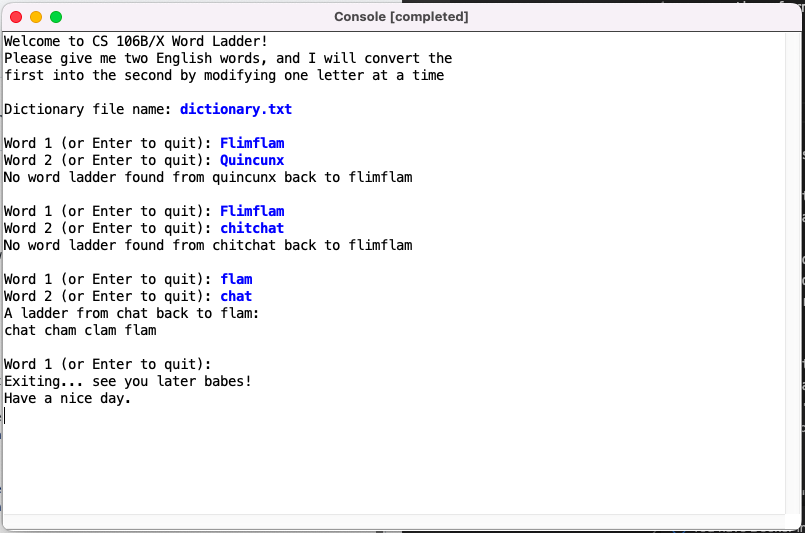
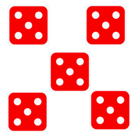
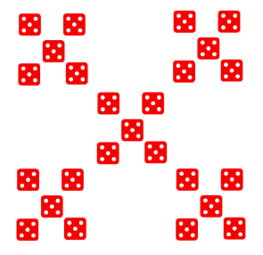

# Word Ladder

A word ladder is a connection from one word to another formed by changing one letter at a time with the constraint that at each step the sequence of letters still forms a valid word

**For example**

`code → cade → cate → date → data`

## How the Word Ladder Works

 - The program prompts the user to input two words and finds a minimum-length ladder between the words using a [breadth-first-search (BFS)](https://en.wikipedia.org/wiki/Breadth-first_search) algorithm
- If there are multiple options for the shortest word ladder, the program will only generate one

- Based on the dictionary.txt input, that there is no wordladder from 'flimflam' to 'quincunx', neither is there one to 'chitchat'
- There is one from 'flam' to 'chat' though.
- For those interested in the meaning/ 'British-isms' of the example words, definitions ([English Collins Dictionary online](https://www.collinsdictionary.com/dictionary/english/)) are listed below

#### Flimflam
`NOUN: 1. a.  nonsense; foolishness... 2. a deception; swindle`

#### [Quincunx](https://en.wikipedia.org/wiki/Quincunx)
`NOUN : 1. a group of five objects arranged in the shape of a rectangle with one at each of the four corners and the fifth in the centre`

#### Chitchat
`UNCOUNTABLE NOUN: Chitchat is informal talk about things that are not very important`

#### Flam
`NOUN: 1. a falsehood, deception, or sham, 2. nonsense; drivel`

#### Chat
`NOUN: 1.  informal conversation or talk conducted in an easy familiar manner`

## Breadth-First-Search (BFS) Algorithm

Word Ladder uses a BFS algorithm to find the shortest word ladder
- The algorithm will check for 1 letter change, 2, 3... n letters change from original word
- It uses a Queue to store partial ladders to explore
- A partial ladder is a Stack
- Overall collection is  a Queue of Stacks

 ## Input Requirements

- Word ladder is case agnostic
- Words 1 and 2 must be:
   - valid dictionary words
   - the same length
   - not they same word
- If the input is invalid, a warning will be displayed to the user
